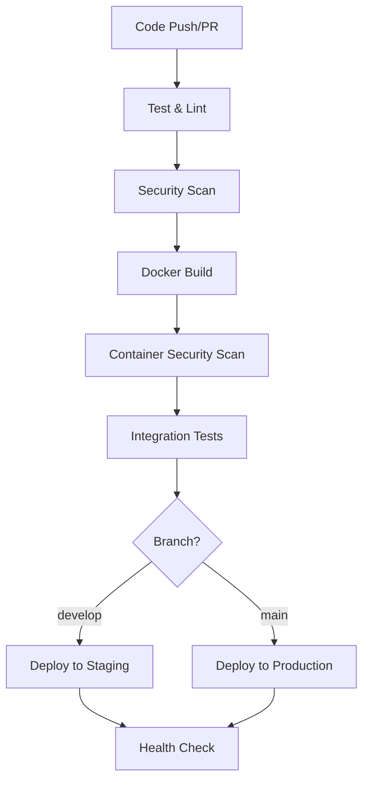

# 🚀 CI/CD Setup Guide

This guide will help you set up a complete CI/CD pipeline for your Full-Stack E-commerce application using GitHub Actions, Docker, and automated deployment workflows.

## 📋 Prerequisites

Before setting up the CI/CD pipeline, ensure you have:

- ✅ **Git** installed and repository connected to GitHub
- ✅ **Docker** and **Docker Compose** installed
- ✅ **Node.js** (v18+) and **npm** installed
- ✅ GitHub repository with **Actions enabled**
- ✅ **Admin access** to your GitHub repository

## 🚀 Quick Setup

### Option 1: Automated Setup (Recommended)

**On Linux/macOS:**
```bash
chmod +x scripts/setup-cicd.sh
./scripts/setup-cicd.sh
```

**On Windows:**
```powershell
Set-ExecutionPolicy -ExecutionPolicy RemoteSigned -Scope CurrentUser
.\scripts\setup-cicd.ps1
```

### Option 2: Manual Setup

Follow the step-by-step instructions below.

## 📁 Repository Structure

After setup, your repository will have this CI/CD structure:

```
.github/
├── workflows/
│   ├── ci-cd.yml              # Main CI/CD pipeline
│   ├── dependency-update.yml  # Automated dependency updates
│   ├── security-scan.yml      # Security scanning
│   ├── manual-deploy.yml      # Manual deployment
│   └── health-check.yml       # Health monitoring
├── docker-compose.staging.yml     # Staging environment
├── docker-compose.production.yml  # Production environment
├── env.example                    # Environment template
└── scripts/
    ├── setup-cicd.sh             # Linux/macOS setup
    └── setup-cicd.ps1            # Windows setup
```

## 🔧 Step-by-Step Setup

### 1. Environment Configuration

1. **Copy environment template:**
   ```bash
   cp env.example .env
   ```

2. **Update `.env` with your values:**
   ```bash
   # Required changes
   GITHUB_REPOSITORY_OWNER=your-github-username
   MONGO_ROOT_PASSWORD=your-secure-password
   JWT_SECRET_PRODUCTION=your-super-secure-jwt-secret
   REDIS_PASSWORD=your-redis-password
   ```

### 2. GitHub Repository Secrets

Add these secrets in **Settings > Secrets and variables > Actions**:

| Secret Name | Description | Required |
|-------------|-------------|----------|
| `MONGO_ROOT_PASSWORD` | MongoDB root password | ✅ |
| `JWT_SECRET_STAGING` | JWT secret for staging | ✅ |
| `JWT_SECRET_PRODUCTION` | JWT secret for production | ✅ |
| `REDIS_PASSWORD` | Redis password | ✅ |
| `GRAFANA_ADMIN_PASSWORD` | Grafana admin password | ✅ |
| `GRAFANA_SECRET_KEY` | Grafana secret key | ✅ |

**Optional secrets for external services:**
- `DOCKER_REGISTRY_TOKEN` - If using external Docker registry
- `SMTP_USER` / `SMTP_PASS` - For email notifications
- `STRIPE_SECRET_KEY` - For payment processing
- `AWS_ACCESS_KEY_ID` / `AWS_SECRET_ACCESS_KEY` - For AWS services

### 3. GitHub Environments

Create environments in **Settings > Environments**:

#### Staging Environment
- **Name:** `staging`
- **Deployment branches:** `develop`
- **Protection rules:** None (auto-deploy)

#### Production Environment
- **Name:** `production`
- **Deployment branches:** `main` only
- **Protection rules:**
  - ✅ Required reviewers: 1-2 people
  - ✅ Wait timer: 5 minutes (optional)
  - ✅ Prevent self-review

### 4. Docker Setup

1. **Verify Docker is running:**
   ```bash
   docker --version
   docker-compose --version
   ```

2. **Build development images:**
   ```bash
   docker-compose -f docker-compose.yml -f docker-compose.dev.yml build
   ```

3. **Test local setup:**
   ```bash
   docker-compose -f docker-compose.yml -f docker-compose.dev.yml up
   ```

## 🔄 CI/CD Pipeline Overview

### Workflow Triggers

| Workflow | Trigger | Purpose |
|----------|---------|---------|
| **CI/CD Pipeline** | Push to `main`/`develop`, PRs to `main` | Full build, test, and deploy |
| **Security Scan** | Daily schedule, push to `main` | Security vulnerability scanning |
| **Dependency Update** | Weekly schedule | Automated dependency updates |
| **Manual Deploy** | Manual trigger | Deploy specific version |
| **Health Check** | Every 30 minutes | Monitor application health |

### Pipeline Stages



## 🐳 Docker Configuration

### Development
```bash
# Start development environment
docker-compose -f docker-compose.yml -f docker-compose.dev.yml up

# Services available:
# Frontend: http://localhost:3000
# Backend: http://localhost:5000
# MongoDB: localhost:27017
# Mongo Express: http://localhost:8081
```

### Staging
```bash
# Deploy staging environment
docker-compose -f docker-compose.staging.yml up

# Use staging images from registry
export IMAGE_TAG=develop-abc123
docker-compose -f docker-compose.staging.yml up
```

### Production
```bash
# Deploy production environment
docker-compose -f docker-compose.production.yml up

# Use production images from registry
export IMAGE_TAG=main-xyz789
docker-compose -f docker-compose.production.yml up
```

## 🔒 Security Features

### Container Security
- ✅ **Multi-stage builds** for smaller production images
- ✅ **Non-root user** execution
- ✅ **Alpine Linux** base images
- ✅ **Vulnerability scanning** with Trivy

### Code Security
- ✅ **Dependency auditing** with npm audit
- ✅ **Secret scanning** with TruffleHog
- ✅ **Code analysis** with CodeQL
- ✅ **SARIF reporting** to GitHub Security tab

### Access Control
- ✅ **Environment protection** rules
- ✅ **Branch protection** for main
- ✅ **Required reviews** for production
- ✅ **Least privilege** access

## 📊 Monitoring & Health Checks

### Application Health
- ✅ **Backend health endpoint:** `/api/health`
- ✅ **Database connectivity** checks
- ✅ **Response time** monitoring
- ✅ **Automated alerting** via GitHub issues

### Infrastructure Monitoring
- ✅ **Prometheus** metrics collection
- ✅ **Grafana** dashboards
- ✅ **Container resource** monitoring
- ✅ **Log aggregation**

## 🚀 Deployment Strategies

### Automatic Deployment
- **Staging:** Triggered on push to `develop` branch
- **Production:** Triggered on push to `main` branch
- **Feature branches:** Build and test only (no deployment)

### Manual Deployment
Use the manual deployment workflow for:
- 🔄 **Hotfixes** outside normal release cycle
- 🎯 **Specific version** deployments
- 🛠️ **Rollback** to previous versions

Trigger via GitHub Actions > Manual Deploy > Run workflow

### Rollback Strategy
1. **Tagged images** for easy version identification
2. **Manual deployment** to specific tag
3. **Health monitoring** for automatic failure detection
4. **Blue-green deployment** support (configuration required)

## 🔍 Troubleshooting

### Common Issues

#### Build Failures
```bash
# Check Docker daemon
docker info

# Verify package.json dependencies
npm audit

# Review build logs in GitHub Actions
```

#### Test Failures
```bash
# Ensure MongoDB is accessible
docker-compose logs mongodb

# Check environment variables
cat .env

# Run tests locally
npm test
```

#### Deployment Issues
```bash
# Verify container registry permissions
docker login ghcr.io

# Check network connectivity
docker network ls

# Review deployment logs
docker-compose logs
```

### Debug Commands

```bash
# Check container logs
docker-compose logs [service-name]

# Inspect container
docker inspect [container-id]

# Execute command in container
docker exec -it [container-name] /bin/sh

# Check network connectivity
docker network inspect [network-name]
```

## 📈 Performance Optimization

### Build Optimization
- ✅ **Layer caching** with Docker BuildKit
- ✅ **Multi-stage builds** for production
- ✅ **Parallel execution** with matrix strategy
- ✅ **Dependency caching** in GitHub Actions

### Runtime Optimization
- ✅ **Resource limits** and reservations
- ✅ **Health checks** for proactive monitoring
- ✅ **Load balancing** with multiple instances
- ✅ **CDN integration** ready

## 🛠️ Customization

### Adding New Services
1. Update `docker-compose.yml` with new service
2. Add service to staging and production configs
3. Update CI/CD pipeline if needed
4. Add health checks and monitoring

### Environment Variables
1. Add to `env.example` with documentation
2. Update GitHub secrets if sensitive
3. Add to staging/production configs
4. Test in development environment

### Workflow Customization
1. Modify `.github/workflows/*.yml` files
2. Add custom steps or jobs
3. Update environment protection rules
4. Test with feature branches first

## 📞 Support

### Getting Help
- 📖 **Documentation:** Check workflow files for detailed comments
- 🐛 **Issues:** Create GitHub issues for bugs
- 💡 **Feature requests:** Use GitHub discussions
- 📧 **Security issues:** Use GitHub security advisories

### Useful Links
- [GitHub Actions Documentation](https://docs.github.com/en/actions)
- [Docker Compose Documentation](https://docs.docker.com/compose/)
- [Node.js Best Practices](https://github.com/goldbergyoni/nodebestpractices)

---

## ✅ Quick Checklist

Before going live, ensure:

- [ ] All secrets added to GitHub
- [ ] Staging and production environments created
- [ ] `.env` file updated with real values
- [ ] Docker builds successfully
- [ ] Tests pass locally
- [ ] Health checks configured
- [ ] Monitoring dashboards accessible
- [ ] Backup strategy in place
- [ ] Team access permissions set
- [ ] Documentation updated

**🎉 Your CI/CD pipeline is ready to deploy!**


